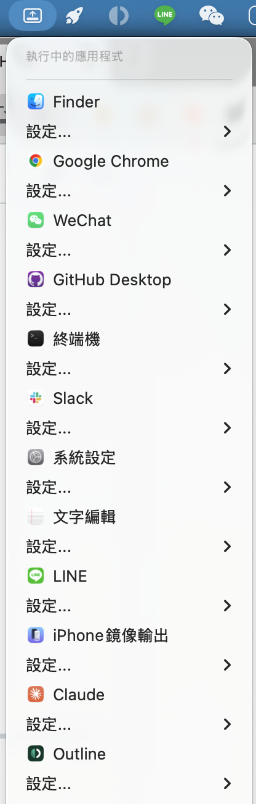

# DockHider 🚀

[](https://buymeacoffee.com/guanrung11n)



[繁體中文](#繁體中文) | [English](#english)

---

## 繁體中文

**DockHider** 是一款專為 macOS 設計的強大選單列工具。它可以讓您隱藏特定應用程式在 Dock 上的圖示，保持工作列簡潔，同時提供極速的視窗喚醒與自定義快捷鍵功能。

### ✨ 核心功能
- **隱藏 Dock 圖示**：修改 App 設定使圖示不顯示在 Dock 上，騰出更多桌面空間。
- **自定義全域快捷鍵**：為每個隱藏的 App **錄製專屬快捷鍵**，即使 App 隱藏了也能一秒喚醒。
- **手動選取 App**：支援選取安裝在非標準路徑（如 Steam、Shared 目錄）的應用程式。
- **自動重新簽署 (Ad-hoc Signing)**：修改 `Info.plist` 後自動修復數位簽章，解決 macOS 「App 已毀損」的阻擋問題。
- **極簡管理介面**：主清單僅顯示您親自隱藏的 App，並支援關鍵字搜尋挑選。
- **一鍵喚醒**：點擊選單中的 App 名稱，立即將其視窗帶到最前景。

### 📖 使用教學
1. **挑選 App**：點擊「挑選 App 隱藏...」從清單搜尋，或使用「手動選擇 App 檔案...」選取特定的 `.app`。
2. **設定權限**：若遇到系統阻擋修改，請點擊選單中的「設定權限」，並在系統設定中開啟 **DockHider** 的開關。
3. **錄製快捷鍵**：點擊 App 右側的 `...` 鈕 -> 「設定快捷鍵...」，直接按下您想要的組合鍵（如 `⌥S`）即可完成綁定。
4. **喚醒 App**：直接點擊選單中的 App 名稱，或按下您設定的自定義快捷鍵。

### 📥 安裝方式 (Homebrew)
```bash
brew install --cask KevinChu1110/tap/dockhider
```

---

## English

**DockHider** is a powerful macOS menu bar utility designed to declutter your workspace. Hide any app icon from the Dock while keeping them instantly accessible via global shortcuts and a clean menu interface.

### ✨ Features
- **Hide Dock Icons**: Toggle application visibility to keep your Dock clean.
- **Custom Global Shortcuts**: Record **per-app shortcuts** to bring hidden windows to the front instantly.
- **Manual App Selection**: Support for apps located in non-standard directories (Steam, Shared, etc.).
- **Automatic Re-signing**: Automatically fixes code signatures after modification to bypass macOS "App is damaged" errors.
- **Clean Management**: The main list only shows apps managed by you, with search filtering for adding new ones.
- **Instant Wake-up**: Click any app in the menu to focus its windows immediately.

### 📖 How to Use
1. **Hide an App**: Use "Pick App to Hide..." to search or "Manually Select .app..." for specific files.
2. **Permissions**: If blocked, click "Settings Permissions" and enable **DockHider** under System Settings > App Management.
3. **Set Shortcuts**: Click `...` next to a hidden app -> "Set Shortcut...", then press your desired key combination (e.g., `⌥S`).
4. **Wake Up**: Click the app name in the menu or use your recorded global shortcut.

### 📥 Installation (Homebrew)
```bash
brew install --cask KevinChu1110/tap/dockhider
```

---

## License
Distributed under the MIT License.

---
*Created with ❤️ by [KevinChu1110](https://github.com/KevinChu1110)*
